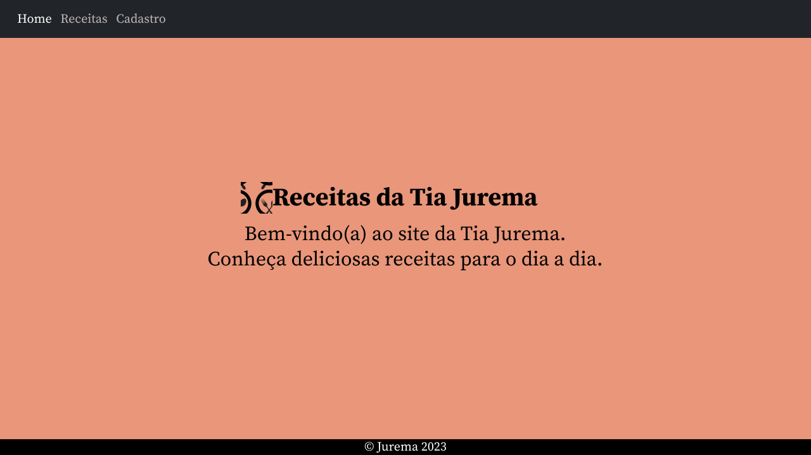

---

[Projeto](#-projeto) • [Como baixar e executar](#-como-baixar-e-executar) • [Páginas](#-páginas) • [Tecnologias utilizadas](#-tecnologias-utilizadas) • [Autor](#-autor) • [Licença](#-licença)

---

## 📋 Projeto

Site com o objetivo de fornecer receitas culinárias implementado com HTML e CSS, utilizando elementos do framework Bootstrap, apresentado como Missão Prática do **`Nível 1: Meu primeiro site cringe`** do **`Mundo 2`** do curso de **`Desenvolvimento Full Stack`** da **`Estácio`**, do semestre de **`2023.2`**, sob a tutoria de Claudio Piccolo Fernandes.

Projeto elaborado de acordo com as diretrizes especificadas para a Missão Prática, que podem ser conferidas [**`clicando aqui`**](https://sway.office.com/s/5vAvCdLPxlEl682F/embed).

## 📥 Como baixar e executar

Para baixar os arquivos deste repositório, você deve ter o [GitHub](https://github.com/) instalado em seu dispositivo.

Após instalado, você deverá acessar a guia `Arquivo` → `Clonar repositório` → `URL` e incluir o caminho `guedesert/meu-primeiro-site-cringe`.

Além disso, é interessante que você tenha um bom editor para trabalhar com os códigos, dos quais eu recomendo o uso do, [Visual Studio Code](https://code.visualstudio.com/).

## 🔗 Páginas

Durante o projeto foram desenvolvidas 03 páginas com as seguintes especificações:

<table>
    <tr>
      <th>Página</th>
      <th>Especificações</th>
    </tr>
    <tr>
      <td>home.html <a href="https://guedesert.github.io/meu-primeiro-site-cringe/pages/home.html" target="_blank">↗️</a></td>
      <td>
        <ul>
          <li>Definir a estrutura básica da página em HTML</li>
          <li>Incluir elementos semânticos para estruturar o site</li>
          <li>Criar uma área para o menu</li>
          <li>Adotar classes Bootstrap na formatação da página</li>
          <li>Adicionar uma imagem como logotipo do site</li>
          <li>Definir a área principal com logotipo, título e mensagem de boas-vindas</li>
          <li>Criar uma área de rodapé com informações de copyright</li>
        </ul>
      </td>
    </tr>
    <tr>
      <td>receitas.html <a href="https://guedesert.github.io/meu-primeiro-site-cringe/pages/receitas.html" target="_blank">↗️</a></td>
      <td>
        <ul>
          <li>Definir a estrutura básica da página em HTML</li>
          <li>Incluir elementos semânticos para estruturar o site</li>
          <li>Criar uma área para o menu</li>
          <li>Definir a área principal com a apresentação do conjunto de receitas</li>
          <li>Apresentar as receitas em divs, organizadas no modo flex</li>
          <li>Organizar cada div com nome da receita, foto do prato, itens utilizados e modo de preparo</li>
          <li>Adotar classes Bootstrap na formatação da página</li>
          <li>Criar uma área de rodapé com informações de copyright</li>
        </ul>
      </td>
    </tr>
    <tr>
      <td>cadastro.html <a href="https://guedesert.github.io/meu-primeiro-site-cringe/pages/cadastros.html" target="_blank">↗️</a></td>
      <td>
        <ul>
          <li>Definir a estrutura básica da página em HTML</li>
          <li>Incluir elementos semânticos para estruturar o site</li>
          <li>Criar uma área para o menu</li>
          <li>Definir a área principal com título e um formulário de cadastro</li>
          <li>Adotar classes Bootstrap na formatação da página</li>
          <li>Utilizar campos obrigatórios como nome, e-mail, rua, número, complemento, cidade, estado e CEP</li>
          <li>Utilizar os tipos corretos para cada campo de entrada, de acordo com os padrões do HTML5</li>
          <li>Enviar as informações do formulário para um endereço de e-mail</li>
          <li>Criar uma área de rodapé com informações de copyright</li>
          <li>Utilizar o modelo de colunas do Bootstrap para organizar o conteúdo do formulário e da página como um todo</li>
          <li>Acrescentar um menu de navegação na área semântica de topo (header)</li>
        </ul>
      </td>
    </tr>
  </table>

Além disso, foi utilizada a API gratuita [ViaCEP](https://viacep.com.br/) para carregamento de dados de localização com base no CEP informado no formulário de cadastro utilizando JavaScript. [↗️](./scripts/buscacep.js)

## 🛠 Tecnologias utilizadas

Para a construção e execução do projeto foram utilizadas as seguintes tecnologias:

 

## 👥 Autor

| Aluno                                                  | Matrícula    | E-mail                                          |
| ------------------------------------------------------ | ------------ | ----------------------------------------------- |
| [Emanuel Roseira Guedes](https://github.com/guedesert) | 202212181407 | [📧](mailto:202212181407@alunos.estacio.br) |

## 📃 Licença

Este repositório está licensiado sob a [Licença MIT](./LICENSE).

